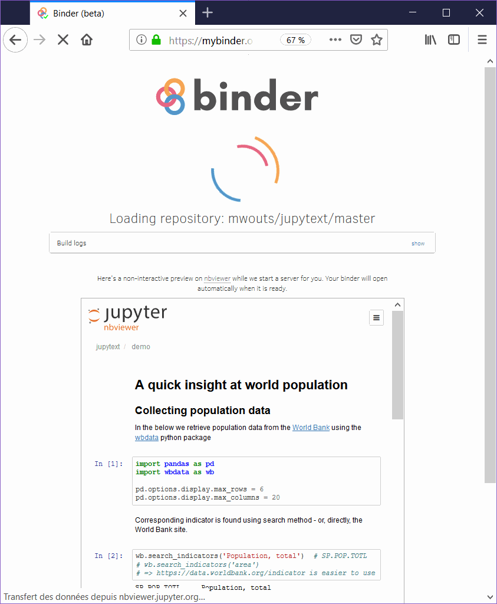
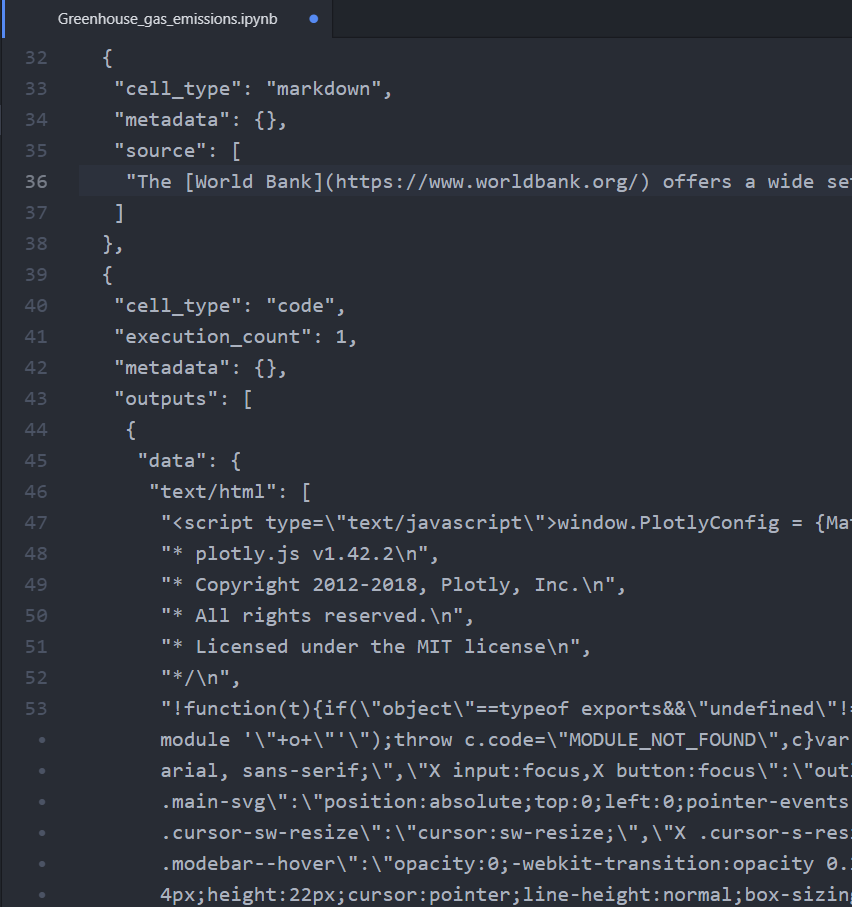
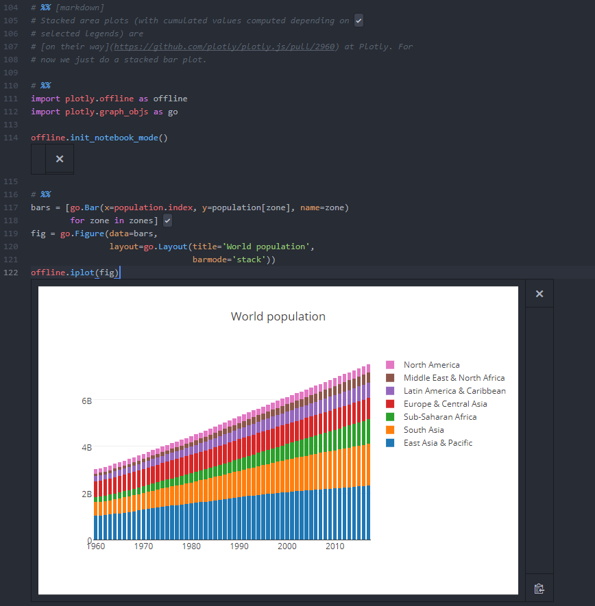
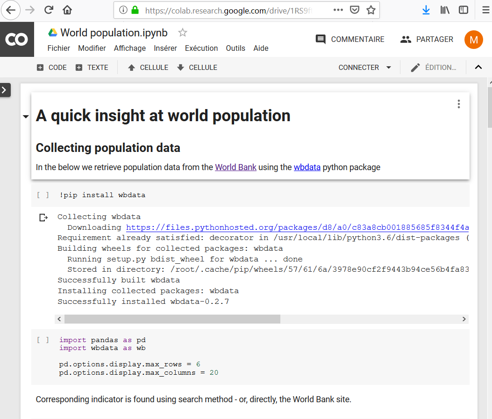
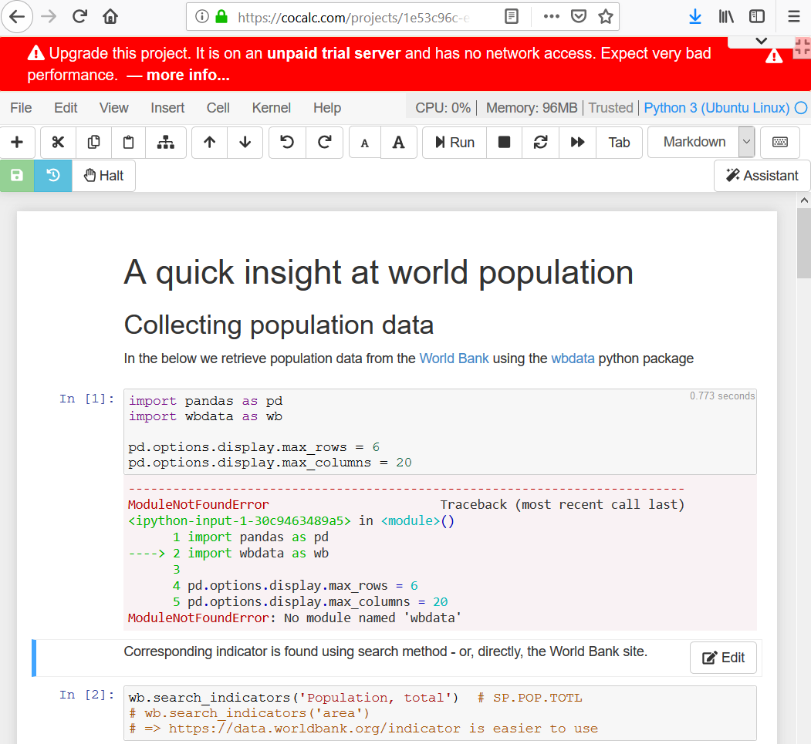

```{r setup, include=FALSE}
knitr::opts_chunk$set(echo = FALSE, cache = TRUE)
```

## Outline

- Introduction
  - Jupyter notebooks
  - And their JSON representation
- Jupytext demo
  - Refactor a notebook
  - Jupytext in Jupyter
  - Paired notebooks
  - Collaborate using Jupytext
- Jupytext formats
- Related projects

# Introduction

## Capital Fund Management

<div style="float: left; width: 40%;">
CFM ([www.cfm.fr](https://www.cfm.fr/)) is a global asset management company, based in Paris,

- with offices in New York City, London, Tokyo and Sydney,
- $10B in assets under management,
- 250+ collaborators.

<br>

Python plays a central role at CFM.
</div>

<div style="float: right; width: 50%; position:relative; top:-50px;">
```{r}
knitr::include_url("https://www.cfm.fr")
```
</div>

## Jupyter notebooks

<div style="float: left; width: 50%;">
Jupyter notebooks are great for

- Exploring data,
- Writing reports,
- Writing documentation.

<br>

Share notebooks:

- as PDF or HTML files,
- on [GitHub](https://github.com/mwouts/jupytext_pyparis_2018/tree/master/notebook),
- on [Jupyter's nbviewer](https://nbviewer.jupyter.org/github/mwouts/jupytext_pyparis_2018/blob/master/notebook/Greenhouse_gas_emissions.ipynb),
- on [MyBinder.org](https://mybinder.org/v2/gh/mwouts/jupytext_pyparis_2018/master?filepath=notebook/Greenhouse_gas_emissions.ipynb).
</div>

<div style="float: right; width: 50%; position:relative; top:-100px">

</div>

## Jupyter notebooks <br> and version control

<div style="float: left; width: 40%;">

Jupyter notebooks are huge JSON files.

Inputs are mixed with outputs: changes are not easy to follow.

Merging JSON is hard: forget one comma, and the notebook becomes invalid.
</div>

<div style="float: right; width: 55%; position:relative; top:-150px">

</div>

## Jupyter notebooks as plain text

&laquo; _Turn my beautiful interactive notebook into a plain and static text file??_ &raquo;

Jupytext's promise:

- a text representation focused on inputs cells only,
- clear version control,
- merge, combine, slice and dice notebooks at will.

<br>

&laquo; _What about my outputs and widgets?_ &raquo;

We also have a solution for that!

# Demo

Get the material for this demo at [mwouts/jupytext_pyparis_2018](https://github.com/mwouts/jupytext_pyparis_2018).

Or, run the `demo_script.sh` online in our 
[binder](https://mybinder.org/v2/gh/mwouts/jupytext_pyparis_2018/master?filepath=demo).


## Example notebook: Greenhouse Gas Emissions


<div style="float: left; width: 40%;">
PWC's [Low Carbon Economy Index 2018](https://www.pwc.co.uk/services/sustainability-climate-change/insights/low-carbon-economy-index.html):

&laquo; _Not one of the G20 countries achieved the 6.4% rate required to limit warming to two degrees this year. That goal is slipping further out of reach &mdash; at current levels of decarbonisation, the global carbon budget for two degrees will run out in 2036._ &raquo;
</div>

<div style="float: right; width: 60%;">
```{r python_setup, active="Rmd"}
library(reticulate)
reticulate::use_condaenv("python3")
```

```{python generate_co2_plot}
import pandas as pd
import json
import plotly
import plotly.graph_objs as go

# My preferences for printing DataFrames: few rows, and many columns.
pd.options.display.max_rows = 6
pd.options.display.max_columns = 20

path = '../demo/1_alice/world_bank_indicators.hdf'
world_bank_data = pd.read_hdf(path, 'indicators')

def world(metric):
    """Value of desired metric, on the World, indexed by date"""
    value = world_bank_data.loc['World'][metric].dropna()
    return value


zones = ['North America', 'Middle East & North Africa',
         'Latin America & Caribbean', 'Europe & Central Asia',
         'Sub-Saharan Africa', 'South Asia',
         'East Asia & Pacific'][::-1]


def regions(metric):
    """Value of desired metric, per world region (column), indexed by date"""
    # World regions, in order of increasing population
    value = world_bank_data.loc[zones][metric].dropna().swaplevel().unstack()[zones]
    return value

data = []


def add_line(full_name, legend_name, scatter_or_bar=go.Scatter, **kwargs):
    value = world_bank_data.loc['World'][full_name].dropna()
    data.append(scatter_or_bar(x=value.index.date, y=value, name=legend_name, **kwargs))


add_line('Total greenhouse gas emissions (kt of CO2 equivalent)', 'Total', line=dict(dash='dash'))
add_line('CO2 emissions (kt)', 'CO2', stackgroup='ghg')
add_line('Nitrous oxide emissions (thousand metric tons of CO2 equivalent)', 'Nitrous oxide', stackgroup='ghg')
add_line('Methane emissions (kt of CO2 equivalent)', 'Methane', stackgroup='ghg')

layout = go.Layout(title='Greenhouse gas emissions', barmode='stack',
                   yaxis=dict(title='CO2 equivalent (kt)'),
                   legend=dict(orientation='h'),
                   width=600, height=500)

fig = go.Figure(data=data, layout=layout)
fig = json.dumps(fig, cls=plotly.utils.PlotlyJSONEncoder)
```

```{r display_plotly_plot, message=FALSE, warning=FALSE}
library(plotly)
library(jsonlite)
plotly::as_widget(
  jsonlite::fromJSON(
    reticulate::py$fig, simplifyVector=FALSE))
```

</div>


## Demo I. Refactoring

- Alice authored a notebook with an introduction on greenhouse gas emissions and some data from the World Bank.
- She converts the notebook to a Python script: `jupytext --to py Greenhouse_gas_emissions.ipynb`.
- Then, she refactors code in the script.
- And updates the input cells in the original notebook with `jupytext --to ipynb --update Greenhouse_gas_emissions.py`.

## Demo II. Jupytext in Jupyter

- Configure Jupyter notebook: 
```python
# Append to .jupyter/jupyter_notebook_config.py
c.NotebookApp.contents_manager_class = "jupytext.TextFileContentsManager"
```
- Restart `jupyter notebook` or `jupyter lab`.
- Now Jupyter can open any Python script as a Jupyter notebook!

## Paired notebooks

Pair a traditional `ipynb` notebook with a `py` file:

- Work on the notebook in Jupyter (and update both files),
- Edit the `py` file in your favorite editor,
- Refresh the notebook in Jupyter:
  - input cells from the `py` file
  - output cells from the `ipynb` file.

<br>
Activate paired notebooks:

- Add `"jupytext": {"formats": "ipynb,py"},` to the notebook metadata.
- Deactivate Jupyter's autosave by running `%autosave 0` in a cell.

## Demo III: Collaborating with Jupytext

- Alice shares the `py` representation of her notebook.
- Bob opens the `py` file _as a notebook_.
- He contributes a few plots and a conclusion.
- Simultaneously, Alice contributes an interactive visualization.
- A merge conflict occurs! We solve it on the `py` file.

## Demo wrap-up

Use Jupytext to:

- Refactor notebooks using an IDE, pep8, `2to3`, etc,
- Merge, slice and dice notebooks,
- Do version control or collaborate on notebooks,
- Edit and run scripts as notebooks in Jupyter
- Run and debug notebooks as scripts in your favorite IDE,
- Run `py.test` or `import` a notebook, etc...

# Formats for Jupyter notebooks as text

## Jupyter notebooks as Python scripts

In the demo we have used the `light` format (created for `jupytext`), which converts notebooks to valid Python scripts:

- Markdown cells are commented.
- Code cells are included verbatim (except Jupyter magics, which are commented).
- Cells are separated with one or more blank lines.
- When a code cell contains blank lines outside of Python paragraphs, we mark the start of the cell with `# +`, and its end with `# -`.

## Python scripts with `# %%` cells

<div style="float: left; width: 45%;">
Use the `py:percent` format to generate scripts with explicit `# %%` cells markers.

Compatible with:

- [Spyder IDE](https://docs.spyder-ide.org/editor.html#defining-code-cells),
- [VS Code](https://marketplace.visualstudio.com/items?itemName=donjayamanne.jupyter),
- [PTVS](https://github.com/Microsoft/PTVS),
- [PyCharm Pro](https://www.jetbrains.com/pycharm/),
- [Hydrogen](https://atom.io/packages/hydrogen).

</div>

<div style="float: right; width: 50%;">

</div>

## Jupyter notebooks as (R) Markdown

R Markdown by Yihui Xie (2012) is an inspiring notebook format. See the recent [_R Markdown: The Definitive Guide_](https://bookdown.org/yihui/rmarkdown/).

Jupyter notebooks as (R) Markdown documents:

- [notedown](https://github.com/aaren/notedown) by Aaron O'Leary (2014): Markdown and R Markdown,
- [ipymd](https://github.com/rossant/ipymd) by Cyril Rossant (2015): Markdown, Python scripts, OpenDocument,
- [ipymd](https://github.com/grst/ipymd) forked by Gregor Sturm (2017): R Markdown and R HTML notebooks,
- And now [jupytext](https://github.com/mwouts/jupytext/): formats `md` and `Rmd`.

Why design `jupytext`? I was obsessed with the lossless round trip conversion!

# Related projects

## Notebook diff and merge

<div style="float: left; width: 60%;">
[nbdime](https://github.com/jupyter/nbdime/blob/master/README.md), by the Jupyter team:

- `nbdiff`: command line diff,
- `nbmerge`: three-way merge,
- `nbdiff-web`: diff notebooks in a browser,
- `nbmerge-web`: merge notebooks in a browser.

`nbdime` can merge the outputs cells of Jupyter notebooks &mdash; unlike `jupytext`.
</div>

<div style="float: right; width: 40%;position:relative;top:-100px">

</div>

## Online collaboration on Jupyter notebooks

Impressive job by [Google Colab](https://colab.research.google.com/) and [CoCalc](https://cocalc.com/)!

<div style="float: left; width: 48%;">

</div>

<div style="float: right; width: 48%;">

</div>

## What's next?

Jupytext is now available on [conda-forge](https://anaconda.org/conda-forge/jupytext).

And we are looking for contributors for a Jupyter [extension](https://github.com/mwouts/jupytext/issues/86). We would like to offer a user-friendly interface (buttons) for

- configuring Jupytext formats,
- and options (comment magics, metadata filters).


## Documentation

In _Towards Data Science_:

- [Introducing Jupytext](https://towardsdatascience.com/introducing-jupytext-9234fdff6c57), and
- [Jupyter Notebooks as Light, Percent or Sphinx scripts](https://towardsdatascience.com/jupyter-notebooks-as-light-percent-or-sphinx-scripts-efca8bc3aa44).

On GitHub:

- Jupytext's [README](https://github.com/mwouts/jupytext/blob/master/README.md).

## Special thanks to

- [Gregor Sturm](https://github.com/grst), who proposed the idea of paired notebooks. He had a lot of other great advice. And he just contributed `jupytext` to conda-forge.
- [Eric Lebigot](https://github.com/lebigot), who tested early versions of the program, and offered helpful advice on technical evolutions and on communication.
- To the early adopters for their encouraging and useful feedback.
- To people reporting issues, and to our [contributors](https://github.com/mwouts/jupytext/graphs/contributors).
- <div id="stars"> And to our stargazers
  <iframe src="https://ghbtns.com/github-btn.html?user=mwouts&repo=jupytext&type=star&count=true&size=large"
    style="width:150px;height:35px;position:relative;top:10px;border:0"></iframe> &mdash; it's so great to know that people like the project!
</div>

# Thanks!